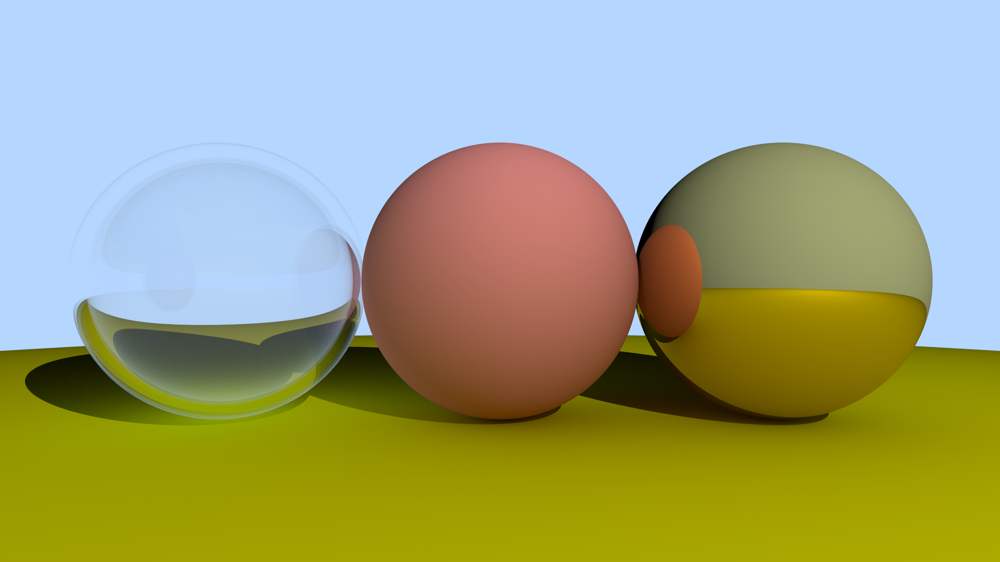

# RaytracingEditor

This project is a 3d scene editor that allows users to organize scenes, and then render them as still images using a raytracing algorithm.
This project uses CUDA. This means you need the CUDA compiler to build it, and it will only run on NVIDIA graphics cards. If you download this project you should be aware that the scene files are set up with absolute file paths, and as such will not load correctly on your machine. If you wish to test it, create a new scene from the start!

Here are some example images and scenes built using this project.

